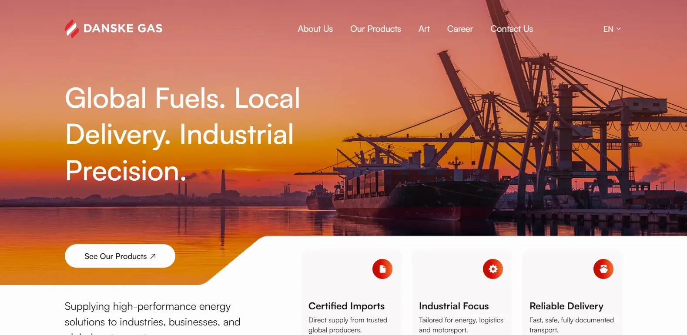

# 🔥 Danske Gas

**Live Demo:** [https://danske-gas.vercel.app](https://danske-gas.vercel.app)

A modern, responsive website for Danske Gas - a leading industrial gas supplier. Built with cutting-edge web technologies to deliver an exceptional user experience with smooth animations and professional design.

## 🚀 About This Project

Danske Gas website showcases the company's industrial gas solutions with a focus on reliability, quality, and professional service. The website features a modern design with smooth animations, responsive layout, and an intuitive contact system for customer inquiries.

### Key Features

- **Responsive Design** - Optimized for all devices and screen sizes
- **Smooth Animations** - Powered by Framer Motion and GSAP
- **Interactive Contact Page** - With animated header and integrated Google Maps
- **Modern UI Components** - Built with Radix UI for accessibility
- **Performance Optimized** - Fast loading with Next.js 15 and Turbopack
- **Professional Styling** - Custom design with Tailwind CSS v4

## 🛠️ Technologies Used

### Frontend Framework

- **Next.js 15.4.5** - React framework with App Router
- **React 19.1.0** - Latest React with concurrent features
- **TypeScript 5** - Type-safe development

### Styling & UI

- **Tailwind CSS v4** - Utility-first CSS framework
- **Radix UI** - Accessible component primitives
- **Lucide React** - Beautiful icon library
- **Class Variance Authority** - Component variant management

### Animations & Interactions

- **Framer Motion 12.23.12** - Production-ready motion library
- **GSAP 3.13.0** - High-performance animations
- **Lenis 1.3.8** - Smooth scrolling library

### Form Handling

- **React Hook Form 7.62.0** - Performant forms with validation
- **Zod 4.0.14** - TypeScript-first schema validation
- **Hookform Resolvers** - Form validation integration

### Additional Libraries

- **Embla Carousel** - Touch-friendly carousel component
- **CMDK** - Command menu component
- **Number Flow React** - Animated number transitions

### Development Tools

- **ESLint 9** - Code linting and formatting
- **Turbopack** - Fast development server
- **PostCSS** - CSS processing

## 📦 Installation & Setup

1. **Clone the repository**
   \`\`\`bash
   git clone <repository-url>
   cd danske-gas
   \`\`\`

2. **Install dependencies**
   \`\`\`bash
   npm install

   # or

   yarn install

   # or

   pnpm install
   \`\`\`

3. **Run the development server**
   \`\`\`bash
   npm run dev

   # or

   yarn dev

   # or

   pnpm dev
   \`\`\`

4. **Open your browser**
   Navigate to [http://localhost:3000](http://localhost:3000)

## 🏗️ Project Structure

\`\`\`
danske-gas/
├── app/ # Next.js App Router
│ ├── contact/ # Contact page
│ ├── layout.tsx # Root layout
│ ├── page.tsx # Home page
│ └── globals.css # Global styles
├── components/ # Reusable components
│ ├── ui/ # UI component library
│ ├── contact-us-header.tsx
│ ├── map-section.tsx
│ └── Icons.tsx
├── hooks/ # Custom React hooks
├── lib/ # Utility functions
├── public/ # Static assets
│ └── assets/ # Images and media
└── ...config files
\`\`\`

## 🎨 Key Components

- **Contact Us Header** - Animated header with scroll effects and mobile menu
- **Map Section** - Interactive Google Maps with fallback image
- **Responsive Navigation** - Mobile-friendly navigation with smooth transitions
- **Animated Text** - Smooth entrance animations for hero content

## 📱 Responsive Design

The website is fully responsive and optimized for:

- **Desktop** (1920px+)
- **Laptop** (1024px - 1919px)
- **Tablet** (768px - 1023px)
- **Mobile** (320px - 767px)

## 🚀 Deployment

The project is deployed on Vercel with automatic deployments from the main branch.

**Production URL:** [https://danske-gas.vercel.app](https://danske-gas.vercel.app)

## 📄 Scripts

- `npm run dev` - Start development server with Turbopack
- `npm run build` - Build for production
- `npm run start` - Start production server
- `npm run lint` - Run ESLint

## 🤝 Contributing

1. Fork the repository
2. Create a feature branch
3. Make your changes
4. Test thoroughly
5. Submit a pull request

---

**Built with ❤️ for Danske Gas**
